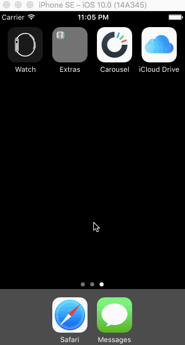

## Carousel

The purpose of this homework is to leverage views, view properties, and events to create a high fidelity prototype that is difficult to distinguish from a production app. We're going to use the techniques from this week to implement the Carousel app from the signed out state to the basic signed in state.

Time spent: `<16>`

### Features

### Required User Stories

1. Landing Screen
  - [X] Static photo tiles on the initial screen.
  - [X] User can scroll to reveal sign in buttons.
1. Sign In
  - [X] Tapping on email/password reveals the keyboard and shifts the scroll view and Sign In button up.
  - Upon tapping the Sign In button.
     - [X] If the username or password fields are empty, user sees an error alert.
     - [X] If credentials are incorrect, user sees a loading indicator for 2 seconds followed by an error alert.
     - [X] If the credentials are correct, user sees a loading indicator for 2 seconds followed by a transition to the Sign In screens.
1. Tutorial Screens
  - [X] User can page between the screens.
1. Image Timeline
  - [X] Display a scrollable view of images.
  - [X] User can tap on the conversations button to see the conversations screen (push).
  - [X] User can tap on the profile image to see the settings view (modal from below).
1. Conversations
  - [X] User can dismiss the conversations screen.
1. Settings
  - [X] User can dismiss the settings screen.
  - [X] User can log out.

### Optional User Stories

1. Landing Screen:  
  - [ ] Photo tiles move, scale and rotate while user scrolls.
1. Sign In:
  - [ ] User can scroll down to dismiss keyboard.
  - [ ] User sees the form scale up and fade it in as the screen appears.
1. Sign up / Create a Dropbox:
  - [ ] Tapping in the form reveals the keyboard and scrolls the form and button up so they remain visible.
  - [ ] Tapping the "Agree to Terms" checkbox selects the checkbox.
  - [ ] Tapping on "Terms" shows a web view with the terms.
  - [ ] User is taken to the tutorial screens upon tapping the "Create a Dropbox" button.
1. Tutorial Screens:
  - [X] User can page between the screens with updated dots.
  - [X] Upon reaching the 4th page, the page indicator dots are hidden and "Take Carousel for a Spin" button is shown.
1. Learn more about Carousel:
  - [ ] Show the "Learn more about Carousel" button in the photo timeline.
  - [ ] Tap the X to dismiss the banner.
  - [ ] Track the 3 events:
     - (1) View a photo full screen, (2) Swipe left and right and (3) Share a photo  - Upon completion of the events, mark them green.
  - [ ] When all events are completed, dismiss the banner.
1. Settings
  - [ ] User is presented with an action sheet with actions to cancel or logout.

#### The following **additional** features are implemented:

- [ ] List anything else that you can get done to improve the app functionality!

Please list two areas of the assignment you'd like to **discuss further with your peers** during the next class (examples include better ways to implement something, how to extend your app in certain ways, etc):

1. 
2. 

### Video Walkthrough 

Here's a walkthrough of implemented user stories:

GIF created with [LiceCap](http://www.cockos.com/licecap/).

## Notes

Describe any challenges encountered while building the app.

Endless, constant challenges. Everything.

* Any libraries or borrowed content.
